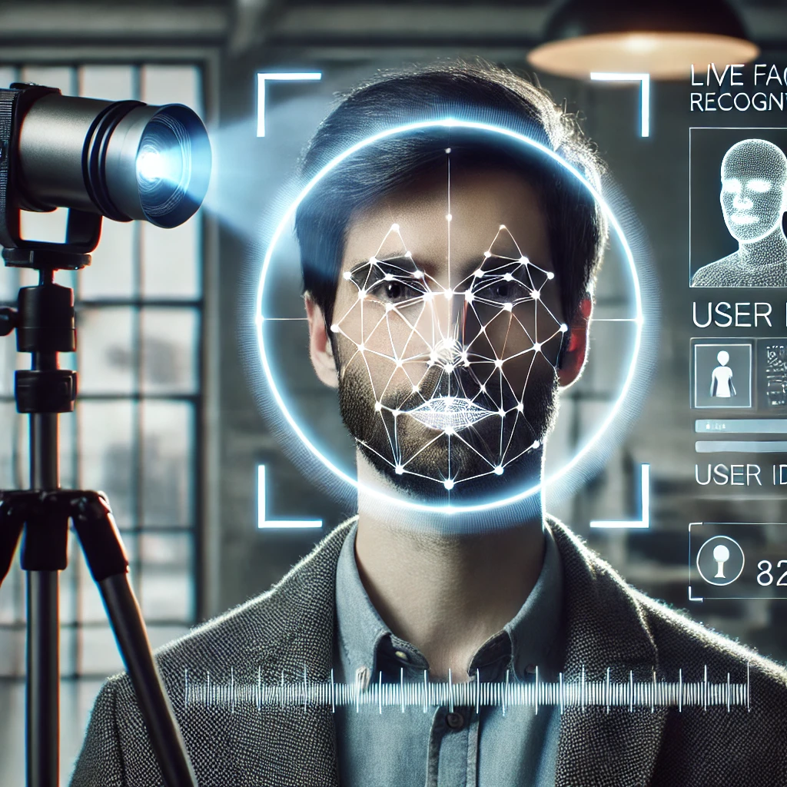

---

# Video Face Verification with DeepFace

## Overview

This project utilizes OpenCV and the DeepFace library to perform real-time face verification against a reference image from a webcam feed.

### Prerequisites

- Python 3.x
- OpenCV (`cv2`)
- DeepFace library
- `WIN_20241221_12_43_41_Pro.jpg` - Your reference image (replace with your own image)

### Installation

1. Clone the repository:
   ```bash
   git clone https://github.com/yourusername/visionary-faces.git
   ```

2. Navigate to the project directory:
   ```bash
   cd visionary-faces
   ```

3. Install dependencies:
   ```bash
   pip install opencv-python deepface
   ```

### Usage

1. Run the main script:
   ```bash
   python main.py
   ```

2. The script opens a webcam feed and performs real-time face verification against the reference image.

3. Press `q` to exit the video stream.

### Customization

- Replace `WIN_20241221_12_43_41_Pro.jpg` with the path to your own reference image.
- Adjust the frame width and height settings to better suit your camera or application needs.
